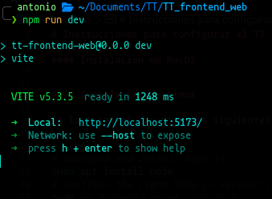
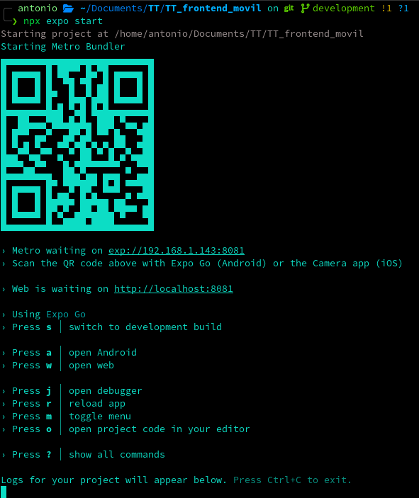
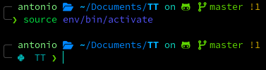
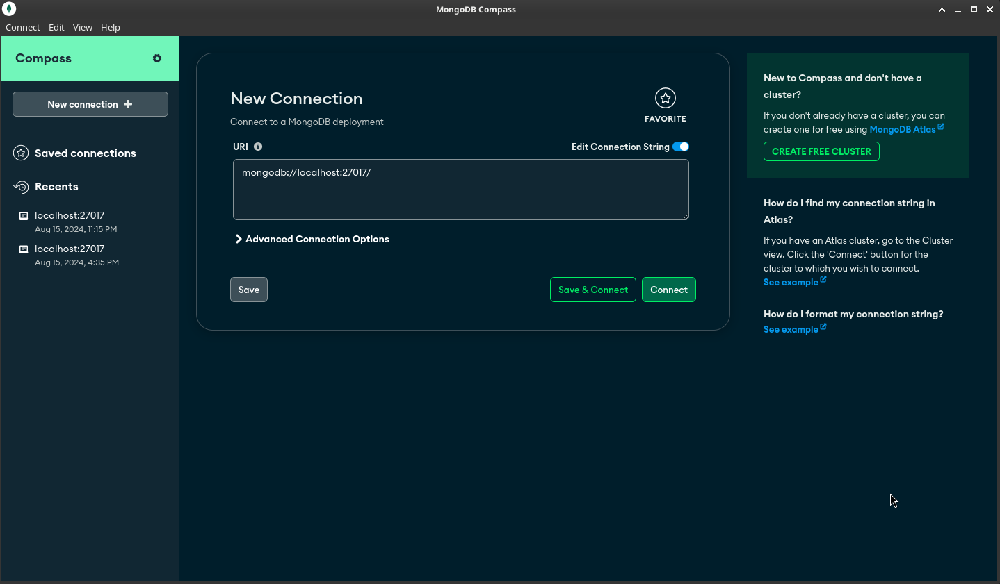
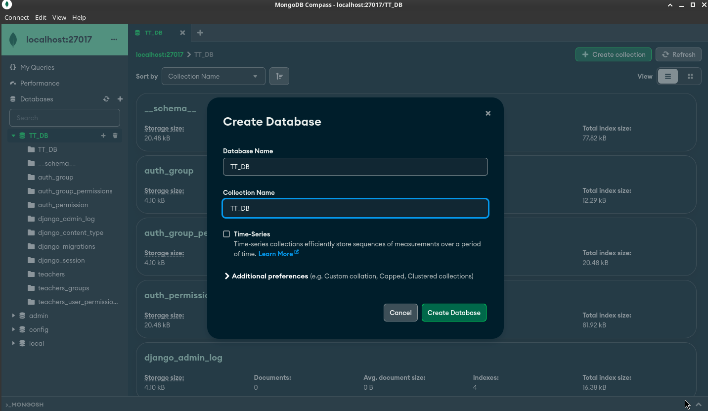
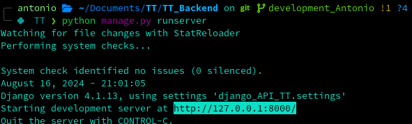

# Instrucciones para configurar el TT

## **Tabla de contenido**

<!--ts-->
* [Instrucciones para configurar el TT](#instrucciones-para-configurar-el-tt)
   * [<strong>Tabla de contenido</strong>](#tabla-de-contenido)
   * [Node js](#node-js)
         * [Instalacion en windows](#instalacion-en-windows)
         * [Instalacion en MacOS](#instalacion-en-macos)
         * [Instalacion en Linux](#instalacion-en-linux)
   * [Frontend WEB](#frontend-web)
         * [Dependencias extras](#dependencias-extras)
   * [Frontend Movil Android/iOS](#frontend-movil-androidios)
      * [Ejecutar en Android/iOS](#ejecutar-en-androidios)
         * [Android](#android)
            * [NOTA](#nota)
         * [iOS](#ios)
      * [Ejecución Web](#ejecución-web)
      * [Ejecucion en <a href="https://docs.expo.dev/get-started/set-up-your-environment/?platform=android&amp;device=simulated" rel="nofollow">emulador android/iOS</a>](https://docs.expo.dev/get-started/set-up-your-environment/?platform=android&amp;device=simulated)
   * [Backend](#backend)
      * [Instalacion de dependencias](#instalacion-de-dependencias)
      * [Instalación de mongo](#instalación-de-mongo)
         * [Linux (Fedora)](#linux-fedora)
      * [Migraciones de bases de datos](#migraciones-de-bases-de-datos)
      * [Ejecución del proyecto](#ejecución-del-proyecto)

<!-- Created by https://github.com/ekalinin/github-markdown-toc -->
<!-- Added by: antonio, at: Fri Aug 16 02:46:43 PM CST 2024 -->

<!--te-->

## Node js
#### Instalacion en windows

En powershell o cmd ejecutar los siguientes comandos

```shell
# installs fnm (Fast Node Manager)
winget install Schniz.fnm
# download and install Node.js
fnm use --install-if-missing 20
# verifies the right Node.js version is in the environment
node -v
# verifies the right npm version is in the environment
npm -v
```

#### Instalacion en MacOS

En la terminal ejecutar los siguientes comandos
```shell
# download and install Node.js
brew install node@20
# verifies the right Node.js version is in the environment
node -v # should print `v20.16.0`
# verifies the right npm version is in the environment
npm -v # should print `10.8.1`
```

#### Instalacion en Linux

En la terminal ejecutar los siguientes comandos

```shell
# download and install Node.js
sudo apt install node
# verifies the right Node.js version is in the environment
node -v # should print `v20.16.0`
# verifies the right npm version is in the environment
npm -v # should print `10.8.1`
```


## Frontend WEB
* Entrar en la carpeta 'TT_frontend_web'

```shell
cd TT_frontend_web/
```
* Una vez dentro ejecutar el siguiente comando, el cual instalará de manera automatica todas las depencias utilizadas en el proyecto

```shell
npm install
```
* Para ejecutar el proyecto utilizar el siguiente comando

```shell
npm run dev
```
* Al ejecutar el comando, hacer clic a la URL generada en Local:


#### Dependencias extras

Si por algun motivo no se instalaron, estos son los paquetes instalados externamente

```shell
npm i react-router-dom react-hot-toast axios react-hook-form
npm install -D tailwindcss postcss autoprefixer
```

## Frontend Movil Android/iOS

* Entrar en la carpeta 'TT_frontend_movil'

```shell
cd TT_frontend_movil/
```
* Una vez dentro ejecutar el siguiente comando, el cual instalará de manera automatica todas las depencias utilizadas en el proyecto

```shell
npm install
```

* Para ejecutar el proyecto utilizar el siguiente comando

```shell
npx expo start
```

* Al ejecutar el comando, se mostrará lo siguiente


### Ejecutar en Android/iOS

#### Android 
Para poder ejecutar el proyecto en un dispositivo android se necesitara de la App de **[Expo](https://play.google.com/store/apps/details?id=host.exp.exponent&referrer=docs)**, la cual se puede encontrar en la Play Store

Tambien se puede conectando el cable usb de la pc al celular, activando las opciones de desarrollador y la opción de *USB Debugging*, y seleccionando la opcion **a** en la terminal

##### NOTA
En linux se debe habilitar el puerto mediante el firewall (Me pase 4 horas para saber esto :( )
```shell
sudo firewall-cmd --zone=public --add-port=PUERTO_DE_APP/tcp --permanent
```
```shell
sudo firewall-cmd --reload
```

En caso de algun error, probablemente en los demás S.O se deba hacer lo mismo

#### iOS
Para poder ejecutar el proyecto en un dispositivo iOS se necesitara de la App de **[Expo](https://itunes.apple.com/app/apple-store/id982107779)**, la cual se puede encontrar en la App Store

Ahora solo queda escanear el codigo QR para poder visualizar la aplicación en el dispositivo movil


### Ejecución Web

Para poder ejecutar el proyecto en una version web podemos acceder al link del localhost generada en la terminal

### Ejecucion en [emulador android/iOS](https://docs.expo.dev/get-started/set-up-your-environment/?platform=android&device=simulated)

## Backend

**Para configurar el backend se debera tener python instalado**

En la carpeta principal del repositorio crear un entorno virtual
```shell
python3 -m venv env
```

Se creará una carpeta con el nombre **env/**
Para activar el entorno virtual se debera ejecutar el siguiente comando
```shell
source env/bin/activate
```

Sabremos que estamos en el entorno virtual debido a que el prompt de la terminal cambiará, y se mostrara el nombre de la carpeta o el del entorno virtual dependiendo el S.O



### Instalacion de dependencias

Para instalar los dependencias se deberá ejecutar el siguiente comando, dentro de la carpeta **TT_Backend/**

```shell
pip install -r requirements.txt
```

Este comando instalará en automatico django y todo lo relacionado a ello, para solo proceder a ejecutar el servidor

### Instalación de mongo
### Windows 
Descargar la version correspondiente a windows de [MongoDB Community Server](https://www.mongodb.com/try/download/community)

#### Linux (Fedora)

```shell
sudo dnf install -y mongodb-org mongodb-mongosh-shared-openssl3
systemctl start mongod
mongosh --version

```

Despues de ejecutar los comandos anteriores con exito instalar [mongodb compas](https://www.mongodb.com/docs/compass/current/install/)

**En windows esté se instalara por defecto al terminar la instalación de MongoDB Community Server**

Al abrir mongo compass, crear una conexion en localhost con los datos por defecto

```js
mongodb://localhost:27017
```




Al crear una conexión, lo siguiente será crear una Base de Datos con el nombre ***TT_DB***



### Migraciones de bases de datos

Dentro de la carpeta **TT_Backend/** ejecutar los siguientes comandos para poder hacer las migraciones y que Django haga la base de datos localmente

```shell
python manage.py makemigration
python manage.py migrate

```

### Ejecución del proyecto

Ejecutar el siguiente comando y hacer clic sobre la URL proporcionada

```shell
python manage.py runserver
```



Acceder a la siguiente URL dentro del navegador
http://127.0.0.1:8000/api/v1/